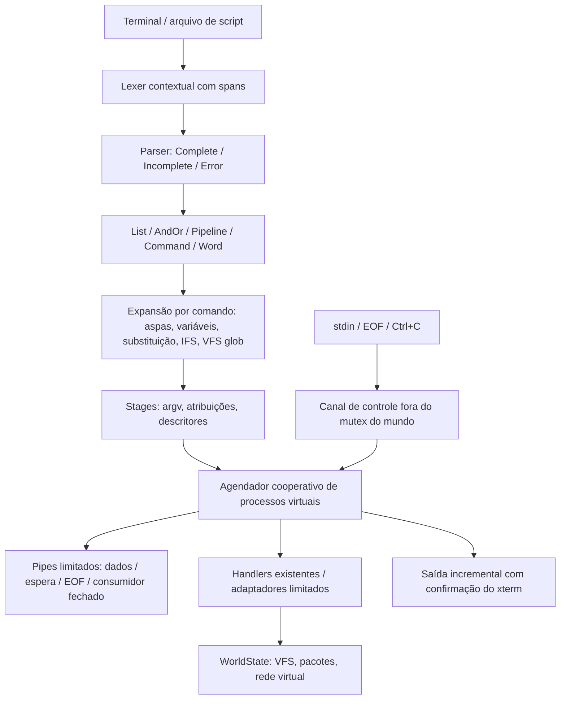

# VirtualShell — arquitetura

Referência semântica: [Bash 5.2.37, manual Debian trixie](https://manpages.debian.org/trixie/bash/bash.1.en.html). O código implementa um subconjunto virtual, sem executar Bash no computador do jogador. As expectativas declaradas não equivalem a capturas de uma instalação externa.

## Componentes

| Arquivo                                    | Responsabilidade                                                                                                                                |
| ------------------------------------------ | ----------------------------------------------------------------------------------------------------------------------------------------------- |
| `src-tauri/src/shell/syntax.rs`            | Lexer contextual, palavras segmentadas, spans em bytes, AST e diagnóstico de entrada incompleta.                                                |
| `src-tauri/src/shell/expansion.rs`         | Expansão preservando proteção de caracteres; IFS; busca de nomes no VFS; execução recursiva de substituições.                                   |
| `src-tauri/src/shell/executor.rs`          | Listas e condições avaliadas depois do status anterior; criação de stages; controle de contexto.                                                |
| `src-tauri/src/shell.rs`                   | Fachada, invocação de scripts/source, contexto transitório, identificação de builtins e busca virtual no PATH.                                  |
| `src-tauri/src/shell_pipeline.rs`          | Descritores virtuais, abertura ordenada de redirecionamentos e execução simples. O adaptador de argv existente não interpreta texto do jogador. |
| `src-tauri/src/shell_pipeline/streams.rs`  | Processos cooperativos, canais limitados, cat/head/yes incrementais e adaptadores de handlers legados.                                          |
| `src-tauri/src/shell/control.rs`           | stdin, EOF, cancelamento e confirmação de saída sem adquirir o mutex do mundo.                                                                  |
| `src/features/terminal/TerminalWindow.tsx` | Entrada e renderização; não interpreta a linguagem shell.                                                                                       |

## Parsing e avaliação

Toda a fonte é validada antes de abrir arquivos. `;` e newline separam listas; `&&` e `||` têm a mesma precedência e associatividade à esquerda; pipelines têm precedência maior. Só o ramo executado passa por expansão. Texto vindo de variáveis ou substituições nunca retorna ao lexer: `VALUE='a > b'` não cria um redirecionamento.

Uma palavra contém segmentos literais, parâmetros e ASTs de substituição. Cada segmento mantém a proteção dada por aspas/escape. A expansão de parâmetros sem aspas passa por IFS e depois por globbing. Uma palavra vazia explicitamente citada permanece argumento. Atribuições não passam por divisão de campos. Redirecionamentos que expandem para zero ou vários nomes falham explicitamente.

O frontend envia linhas incompletas ao mesmo parser Rust. O backend guarda a continuação por terminal e devolve `shellIncomplete`; a próxima linha completa a fonte. Ctrl+C descarta a continuação. O histórico mantém o comando original, antes das expansões.

## Streams e descritores

Cada ligação de pipeline tem capacidade de **64 KiB**, com chunks de até **4 KiB**. O agendador visita consumidores antes de produtores, permite progresso parcial e suspende a produção quando o pipe enche. Vazio com escritor ativo significa espera; vazio com escritor encerrado significa EOF. O encerramento do consumidor descarta a fila restante e causa status 141 no produtor que tentar escrever. O status público do pipeline continua sendo o último estágio, sem `pipefail`.

`yes` produz progressivamente; `cat` sem transformações encaminha stdin; `head` por linhas encerra a leitura ao atingir a quantidade. Os outros handlers mantêm seus contratos existentes por adaptadores limitados a 4 MiB de entrada/saída agregada. Esses adaptadores não se tornam implementações completas de coreutils. Um `grep -m` legado, por exemplo, ainda recebe a entrada agregada antes de executar.

As conexões iniciais do pipeline são aplicadas antes dos redirecionamentos. Depois, os redirecionamentos são aplicados da esquerda para a direita. Duplicar um descritor copia o destino atual: `>out 2>&1` e `2>&1 >out` têm resultados diferentes. stdout e stderr permanecem separados quando não há duplicação explícita. `/dev/null` é virtual.

A saída para xterm usa `cli_contract::Event` por Channel do Tauri. A produção aguarda quando há 64 KiB sem confirmação; o frontend confirma depois do callback de escrita do xterm. O resultado final ainda contém streams agregadas para compatibilidade com outros consumidores. O renderer desconta os trechos já recebidos, inclusive quando a entrega final ocorre antes de todos os callbacks. A limitação de scrollback visual não modifica pipes ou arquivos.

## Contexto, processo e job

O contexto contém cwd, usuário, host virtual, env, variáveis exportadas, argumentos posicionais, status anterior, PID virtual e controle de source/exit. Um comando simples executa builtins de estado no contexto pai. Estágios de pipeline e `bash`/`sh` recebem contextos filhos; `source` compartilha o contexto e restaura os argumentos posicionais ao retornar. A substituição de comandos herda variáveis locais e restaura o contexto do chamador, preservando efeitos no VFS e stderr.

Os PIDs são alocados pelo runtime virtual. Estágios entram em `WorldState.processes` durante a execução e são removidos ao encerrar/cancelar. Isso não cria processos do sistema operacional. Um job de arquivo existente continua sendo um conjunto de trabalho assíncrono gerenciado pelo módulo de arquivos; não foi substituído por uma segunda implementação. Background geral, grupos de processos, `fg`, `bg` e `wait` continuam fora deste marco.

O comando roda no worker já existente do Tauri. A transação do mundo permanece ocupada até terminar; entrada, cancelamento e confirmações de saída usam um canal separado. Operações de outros aplicativos que dependem da fila de mutação podem aguardar um comando interativo. Liberar essa transação por quantum, com continuações para handlers legados, permanece uma limitação explícita de `SHELL.JOBS`.

## Resolução e isolamento

Builtins são resolvidos no shell. Executáveis de pacotes usam a resolução existente com PATH, ownership, instalação, modo executável e conteúdo do binding. Scripts por caminho absoluto/relativo ou PATH usam arquivos virtuais e shebangs Bash/sh aceitos. Não existe fallback para processos, arquivos, DNS, sockets ou programas do computador real.

Os novos contextos e canais são transitórios. `TerminalSession.shell` usa `serde(skip)` e `Default`; não altera o schema persistido de saves. Fechamento do terminal, logout e carregamento cancelam trabalho ativo pelo canal de controle. Casos de save/load verificam que variáveis, continuações e processos ativos não viram estado persistente.

O payload de coreutils inclui agora `/usr/bin/yes`. Saves antigos com o baseline 9.7 recebem somente esse binding ausente, com ownership e projeções de pacote consistentes. A extensão é idempotente e preserva arquivos personalizados e arquivos removidos intencionalmente após a instalação do binding.

## Limites

- Fonte: 64 KiB; 8 níveis de substituição/invocação; 16 estágios por pipeline.
- Argumentos expandidos: 16.384 campos / 1 MiB.
- Padrões glob: 4.096 caracteres e orçamento de 8 milhões de comparações estimadas por palavra; excesso é erro explícito.
- Cada pipe e canal de entrada/saída pendente: 64 KiB.
- Captura de saída e adaptador legado: 4 MiB; excesso é erro explícito.
- VFS existente: 10.000 nós e 1 MiB por arquivo de texto; bytes arbitrários e travessia geral de symlinks continuam limitados.
- Handlers legados não são interrompidos no meio de uma chamada; o cancelamento é observado entre chamadas/quanta.

## Verificação

Casos declarativos: `tests/cli/compat/pilot/shell-foundation.json`. Proveniência: `tests/cli/references/bash/5.2.37/manifest.json`. Testes de estrutura, fuzz, limites, controle e isolamento: `shell/foundation_tests.rs` e `shell_pipeline/streams.rs`. Medições DEV: `shell/performance_tests.rs`, invocadas por `cli:compat`.

O relatório [gerado](../generated/shell-compatibility.md) recalcula cada capability com evidência atual. Bash completo permanece PARTIAL. Nenhuma contagem VERIFIED é escrita manualmente.

O manifest permite `shellRequirements` por família/comando. Coreutils declara as sete capacidades da fundação; `SHELL.JOBS = PARTIAL` não o bloqueia. Consumidores sem declaração continuam usando a dependência agregada conservadora. O grafo e a proteção contra regressões incluem as capacidades individuais.
